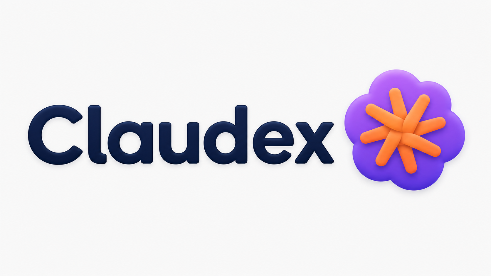

<div align="center">



# Claudex

### Connect **Claude Code** with **Codex CLI** — share context, switch tools mid-thought, never lose your session

**Claudex** is a local, open-source session bridge that lets [Claude Code](https://docs.claude.com/claude-code) and [OpenAI Codex CLI](https://github.com/openai/codex) talk to each other without losing context. When Claude Code hits its rate limit you jump to Codex, and Codex already knows what you were working on. When you have a better idea while in Codex you switch back to Claude Code, and it picks up exactly where you left off.

[](https://www.npmjs.com/package/claudex)
[](LICENSE)
[](https://nodejs.org)
[](CONTRIBUTING.md)
[](https://github.com/unlikesooraj/claudex/stargazers)

`claude-code` · `codex` · `codex-cli` · `mcp-server` · `agents.md` · `session-bridge` · `context-handoff` · `agentic-cli`

</div>

---

## The problem this solves

You pay for both **Claude Code** (Anthropic) and **OpenAI Codex CLI**. You're deep in a debug session and one of these happens:

- **Claude Code hits its session limit** mid-task. Pro users hit it after ~20–30 minutes of agent work; even Max 20x users routinely report session and weekly caps after a few heavy days.
- **You want a second opinion** from a different model on a tricky bug.
- **Codex's repo-scoped memory** is better for one part of the job, Claude's interactive feel is better for another.

So you switch tools — and **the new one has no idea what you were doing**. You paste a summary, the new tool half-understands, momentum dies. Two $200/month subscriptions and you're still copy-pasting context.

**Claudex fixes this** by tailing both tools' transcript files in real time, maintaining a rolling context per project folder, and injecting it into whichever tool you open next. No API keys, no cloud, no proxy, no subscription tampering. Each tool keeps using its own auth and its own backend. Claudex just makes them share notes.

```
┌─────────────────┐      ┌────────────────────┐      ┌─────────────────┐
│  Claude Code    │ ───► │   Claudex daemon   │ ◄─── │   Codex CLI     │
│  writes JSONL   │      │                    │      │  writes JSONL   │
└─────────────────┘      │  - watches both    │      └─────────────────┘
        ▲                │    transcript dirs │              ▲
        │                │  - normalises +    │              │
        │                │    interleaves     │              │
        │ SessionStart   │    chronologically │  AGENTS.md   │
        │ + UserPrompt   │  - rolling 2K-tok  │  managed     │
        │   Submit       │    context.md /    │  block       │
        │   hooks        │    plan.md per     │  + MCP       │
        │                │    project         │              │
        └─── context.md ─┴────────────────────┴── context.md ┘
```

---

## What people search for that this fixes

If you arrived here from a Google or HN search, this project is the answer to:

- *"How do I connect Claude Code with Codex CLI?"*
- *"How do I share context between Claude Code and Codex?"*
- *"Claude Code keeps hitting its rate limit — what's the alternative?"*
- *"Can I use Claude Code and Codex CLI side by side without losing context?"*
- *"Persistent memory across Claude Code and Codex sessions"*
- *"How to switch from Claude Code to Codex without re-explaining everything"*
- *"Smart session sharing between Codex application and Claude Code application"*
- *"Linking Claude Code application and Codex application"*
- *"Dual wielding Claude Code and Codex"*
- *"Cross-tool agent memory MCP server"*
- *"AGENTS.md / CLAUDE.md auto-sync"*
- *"Switch AI coding tools mid-task"*
- *"Codex CLI plugin for Claude Code (session sharing)"*

---

## Features

- **Seamless connection between Claude Code and Codex CLI.** Both tools' transcripts (`~/.claude/projects/*.jsonl` and `~/.codex/sessions/*.jsonl`) are watched in real time, normalised to a canonical schema, and merged by working directory.
- **Switch tools mid-thought.** Start in Claude Code, finish in Codex (or the reverse). The receiving tool already knows your plan, recently touched files, and the last 2,000 tokens of conversation.
- **Three layers of context refresh** so you never have to repeat yourself:
  1. **Session start** — Claude Code `SessionStart` hook injects context. Codex reads project-local `AGENTS.md`.
  2. **Every user prompt (Claude)** — `UserPromptSubmit` hook re-injects rolling context, gated by mtime so token cost is zero when nothing has changed.
  3. **On-demand mid-session** — built-in MCP server (`claudex_get_context`, `claudex_get_plan`, `claudex_recent_files`) registered into both Claude Code's `mcpServers` and Codex's `mcp_servers`. The model can pull fresh state any time a user references something it doesn't see.
- **Auto-discovers every project.** On install, Claudex scans your entire `~/.claude/projects` and `~/.codex/sessions` history and builds a context for every folder you've ever opened in either tool. Zero per-project setup. Ever.
- **Project keying by working directory.** Both tools' transcripts merge automatically as long as they were opened in the same folder. SHA-256 hash of the cwd is the join key.
- **Rolling 2,000-token context window per project.** Token-counted with `cl100k_base`, configurable budget. Designed to fit comfortably inside any model's context with room to spare.
- **Active plan extraction.** Detects *"the plan is…"* / numbered steps / markdown checklists from recent assistant turns and surfaces them at the top of the injected context.
- **Recent files tracker.** Pulls file paths out of recent tool calls so the receiving tool knows what you've been editing.
- **Daemon autostart on every OS.** Windows Startup `.vbs`, macOS LaunchAgent, Linux systemd-user. Survives reboots. You install once and forget it exists.
- **Pure local. Pure private.** No API keys, no cloud, no telemetry, no proxy. Your transcripts never leave your machine.
- **Zero native dependencies.** No `node-gyp`, no Visual Studio Build Tools, no Xcode CLT. `npm install -g claudex` and you're done.
- **MIT licensed.** Use it, fork it, ship it inside your own product.

---

## Quick start — connect Claude Code with Codex CLI in 60 seconds

> Requires Node.js 20+, plus at least one of Claude Code or Codex CLI installed.

```bash
npm install -g claudex
claudex init
```

That single command:

1. Patches `~/.claude/settings.json` to add the `SessionStart`, `UserPromptSubmit`, and `Stop` hooks + registers Claudex as an MCP server.
2. Patches `~/.codex/config.toml` to add the `notify` hook + registers Claudex as an MCP server.
3. **One-shot ingests every existing session** from both tools (in real-world testing: 36,300 turns across 25 projects from 1,008 JSONL files in under 30 seconds).
4. Registers the background daemon to autostart on user login.
5. Spawns the daemon now.

Open any project in either tool. Claudex is already working.

```bash
claudex status       # daemon + tracked projects
claudex projects     # full project list
claudex context      # what the next session in this folder will see
claudex log          # tail the daemon log
```

---

## How does Claudex compare to other tools?

| Tool | What it does | How Claudex is different |
|---|---|---|
| **[claude-mem](https://github.com/thedotmack/claude-mem)** | Persistent memory plugin for Claude Code (also supports Codex, Gemini). Compresses past sessions with AI and re-injects them. | claude-mem is single-tool focused (per-agent memory). **Claudex is purpose-built for the Claude Code ↔ Codex CLI handoff** — both tools see the same canonical conversation graph, no compression model in the loop, lossless within the rolling window. |
| **[hydra](https://github.com/saadnvd1/hydra)** | Unified wrapper around Claude Code, Codex, OpenCode, Pi with automatic fallback when one hits a rate limit. | Hydra is a launcher that switches *for* you. **Claudex assumes you choose when to switch** and just keeps both tools' state aligned. The two are complementary — you can run them together. |
| **[context-mode](https://github.com/mksglu/context-mode)** | Sandbox tool output to compress context window usage. | Different problem. Context-mode optimises within a session. **Claudex bridges across sessions and across tools.** |
| **`claude --resume`** | Built-in: lets you resume your own previous Claude Code session by id. | Same-tool only. **Claudex carries state cross-tool**, including across `claude → codex → claude` chains. |
| **`/compact` command in Claude Code** | Built-in: compresses current conversation. | Reactive and same-tool. **Claudex is proactive and cross-tool.** |
| **Manual `AGENTS.md` / `CLAUDE.md` files** | Hand-authored shared instructions. | Static. **Claudex auto-writes a managed `<!-- claudex:start -->` block into `AGENTS.md`** that updates as you work. |

---

## Architecture

### How does the cross-tool context handoff actually work?

1. A small daemon (using [`chokidar`](https://www.npmjs.com/package/chokidar) for filesystem watching) tails `~/.claude/projects/**/*.jsonl` and `~/.codex/sessions/**/*.jsonl`.
2. Every new turn from either tool is parsed, normalised into a canonical `Turn` schema (role, text, thinking, tool calls, timestamps), and appended to `~/.claudex/mirror/<project-hash>/timeline.jsonl`.
3. For each project (keyed by SHA-256 of the cwd) Claudex maintains:
   - `~/.claudex/shared/<hash>/context.md` — rolling 2,000-token window of the last turns from both tools, chronologically interleaved.
   - `~/.claudex/shared/<hash>/plan.md` — extracted active plan / open todos.
   - `~/.claudex/shared/<hash>/recent-files.txt` — recently touched files.
4. The receiving tool loads this context via three mechanisms:
   - **Claude Code** — `SessionStart` hook injects context via the documented `additionalContext` mechanism; `UserPromptSubmit` hook re-injects on every prompt (mtime-gated so it's free when nothing changed).
   - **Codex CLI** — a managed `<!-- claudex:start --> ... <!-- claudex:end -->` block is written into `<project>/AGENTS.md`. Codex auto-loads `AGENTS.md` on every session.
   - **Both tools, mid-session** — the built-in MCP server exposes `claudex_get_context`, `claudex_get_plan`, `claudex_recent_files`. The `AGENTS.md` block instructs the model to call `claudex_get_context` whenever the user references state the local view doesn't have.

### Privacy guarantees

Claudex is 100% local. The daemon reads files your tools already write (`~/.claude/projects` and `~/.codex/sessions`) and writes derived files under `~/.claudex/` plus a managed block in each project's `AGENTS.md`. **No telemetry. No cloud. No external API calls. Your transcripts never leave your machine.** Treat `~/.claudex/` as you would treat your shell history.

---

## Use cases — when should I install Claudex?

You should install Claudex if:

- You hit **Claude Code's session or weekly rate limit** mid-task and want to keep working without losing your place.
- You **dual-wield Claude Code and Codex CLI** on the same repository and want them aware of each other.
- You **switch between projects often** and want every folder to remember what the last AI session there was working on.
- You work across machines or sessions and want a **persistent rolling context** without paying for cloud memory tools.
- You're building or maintaining an **AI coding agent workflow** and need a normalised view of activity across multiple agents.
- You've used `claude-mem`, `hydra`, `aider`, or `continue.dev` and want **specifically the Claude Code ↔ Codex bridge** that none of them quite solve.

You probably don't need Claudex if:

- You only ever use one of these tools.
- Your sessions are short and contextless.
- You're fine pasting summaries by hand.

---

## FAQ

### How do I connect Claude Code with Codex CLI?

Install Claudex (`npm install -g claudex && claudex init`). It patches both tools' configs, registers the bridge daemon to autostart, and pre-ingests every existing session. Open any project in either tool — the bridge runs in the background and the context follows you.

### What happens when Claude Code hits the rate limit?

You quit Claude Code, open Codex CLI in the same folder, and start typing. Codex auto-loads the project's `AGENTS.md` which Claudex has populated with the rolling 2K-token context window — so it already knows what you were doing. No re-explanation, no re-summarisation.

### Does Claudex use my Anthropic or OpenAI API keys?

**No.** Claudex never makes API calls. It only reads local transcript files that both tools already write to disk, and writes derived markdown files locally. Your existing Claude Code and Codex CLI subscriptions handle all the actual model traffic.

### Will Claudex mess up my existing `AGENTS.md` or `CLAUDE.md`?

No. If you have an existing `AGENTS.md` in a project, Claudex appends a managed `<!-- claudex:start --> ... <!-- claudex:end -->` block to it (or refreshes that block in place if it already exists). Everything outside the markers is untouched. If you delete the markers, Claudex respects that.

### Does this work cross-machine?

v0.1 is single-machine. **Cross-machine encrypted sync via Syncthing/iCloud/Git is on the [roadmap](ROADMAP.md)** for v0.4. The daemon state under `~/.claudex/mirror/` is pure JSONL and trivially syncable today if you want to roll your own.

### Can I use Claudex with Aider, Cursor CLI, Cline, Gemini CLI, Continue.dev?

Not yet, but **adding a parser for any agentic CLI is ~1 hour of work** and a great first contribution. See [CONTRIBUTING.md](CONTRIBUTING.md) and the parser layout in `src/parsers/`.

### Is the rolling context lossless?

Within the 2,000-token window, **yes** — exact user and assistant text from both tools, in chronological order. Outside the window, older turns live in `~/.claudex/mirror/<hash>/timeline.jsonl` and can be queried via the MCP server. Full session forgery (lossless across the whole conversation, not just the rolling window) is the headline feature of v0.2 — see [ROADMAP.md](ROADMAP.md).

### Does Claudex respect privacy?

Yes — everything is local. No network calls. No telemetry. Redaction rules to auto-strip API keys / secrets before they enter `context.md` are on the roadmap (v0.4). For now, treat `~/.claudex/` as you would treat your shell history.

---

## Commands

| Command | Description |
|---|---|
| `claudex init` | One-shot install: patches both tools' configs, bulk-ingests history, registers autostart, spawns the daemon. |
| `claudex sync` | Re-ingest every existing Claude Code + Codex CLI session (idempotent). |
| `claudex status` | Show daemon status and recently tracked projects. |
| `claudex projects` | Full list of projects the bridge knows about. |
| `claudex context [--cwd <path>]` | Print the rolling context for a project. |
| `claudex rebuild [--budget 2000]` | Force-rebuild the context for the current working directory. |
| `claudex log [-n 60]` | Tail the daemon log. |
| `claudex daemon` | Run the daemon in the foreground (for debugging). |
| `claudex autostart {enable,disable}` | Manage daemon-on-login registration. |

## Configuration

| Variable | Default | Purpose |
|---|---|---|
| `CLAUDEX_HOME` | `~/.claudex` | Where all daemon state lives. |

Per-project overrides via `.claudex/config.yml` are on the [roadmap](ROADMAP.md) (v0.4).

---

## Contributing

The two highest-leverage areas to help:

1. **Parsers for more agentic CLIs** — Aider, Cursor CLI, Cline, Continue.dev, Gemini CLI, Goose, OpenCode, Q CLI. Each is ~1 hour: drop a file in `src/parsers/`, wire it into `src/daemon.ts`, add a redacted fixture.
2. **The lossless v0.2 features** — synthetic resume file forgery, full tool-call schema translation, Ollama-assisted plan extraction. See [ROADMAP.md](ROADMAP.md).

Read [CONTRIBUTING.md](CONTRIBUTING.md) for dev setup and the design principles (no native deps, no telemetry, never write outside managed markers).

## Roadmap

See [ROADMAP.md](ROADMAP.md) for the full list. Highlights coming next:

- **Synthetic resume files** — translate a Claude Code session into a forged Codex `rollout-*.jsonl` (and vice versa), exec `--resume <id>` so the receiving tool loads it as native history. Fully lossless cross-tool handoff.
- **Tool-call schema translation** between Anthropic and OpenAI formats.
- **Local LLM plan extractor** (Ollama).
- **Parsers** for Aider, Cursor CLI, Cline, Continue.dev, Gemini CLI, Goose, OpenCode, Q CLI.
- **Live dashboard** at `localhost:7711` showing the merged timeline.

## Related reading

- [Claude Code documentation](https://docs.claude.com/claude-code)
- [OpenAI Codex CLI](https://github.com/openai/codex)
- [Model Context Protocol (MCP)](https://modelcontextprotocol.io)
- [AGENTS.md spec](https://github.com/openai/codex#agentsmd) — Codex's project-local instruction file
- [CLAUDE.md spec](https://docs.claude.com/claude-code/memory) — Claude Code's project memory file

## License

MIT — see [LICENSE](LICENSE). Use it however you want.

---

<div align="center">

**If Claudex saves you from one rate-limit-induced rage moment, please ⭐ the repo so others can find it.**

[Report a bug](https://github.com/unlikesooraj/claudex/issues/new?template=bug.md) · [Request a feature](https://github.com/unlikesooraj/claudex/issues/new?template=feature.md) · [Discussions](https://github.com/unlikesooraj/claudex/discussions)

</div>
